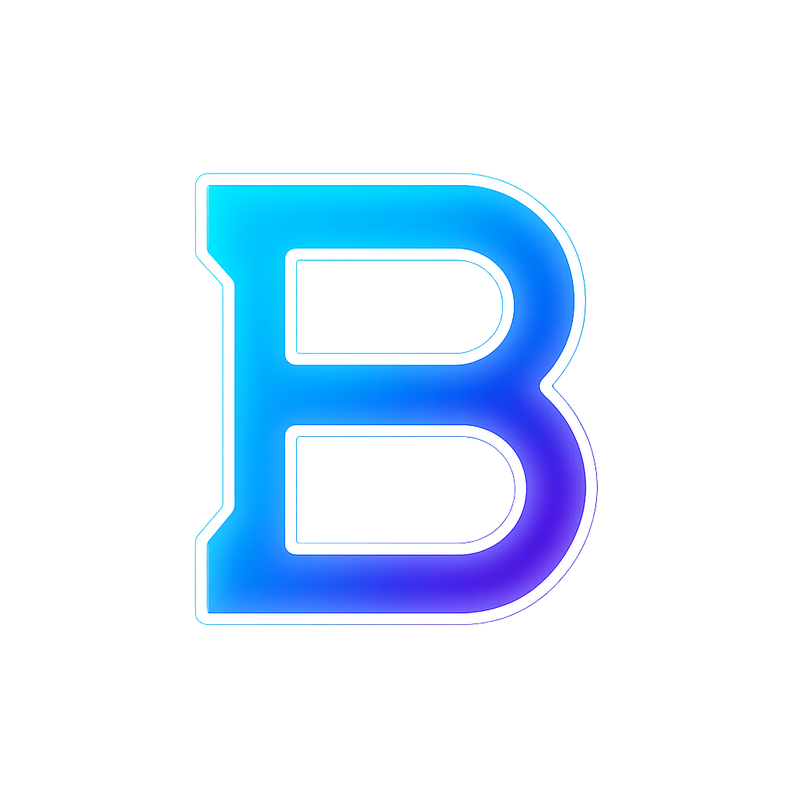

# Bleets Academy - Personalized Web Development Training Platform

A modern, cyberpunk-themed landing page for Bleets Academy, built with Next.js, TypeScript, and Tailwind CSS. The platform offers personalized 1-on-1 web development training with expert mentors.



## 🚀 Features

- **Modern Tech Stack**: Built with Next.js 15.3, React 19, TypeScript, and Tailwind CSS
- **Responsive Design**: Fully responsive layout with mobile-first approach
- **Animated UI**: Smooth animations and transitions using Framer Motion
- **Custom Components**: Includes custom-built UI components using shadcn/ui
- **Multi-step Form**: Interactive registration process with state management using Zustand
- **SEO Optimized**: Includes metadata configuration and Google Analytics integration

## 🏗 Project Structure

```
├── app/                  # Next.js app directory
│   ├── layout.tsx       # Root layout with fonts and analytics
│   ├── page.tsx         # Homepage component
│   └── globals.css      # Global styles
├── components/          # React components
│   ├── ui/             # Reusable UI components
│   ├── Hero.tsx        # Landing page hero section
│   ├── Features.tsx    # Features showcase
│   ├── Curriculum.tsx  # Course curriculum section
│   ├── Pricing.tsx     # Pricing plans
│   └── CTA.tsx         # Call-to-action section
├── data/               # Static data files
│   ├── featuresData.js # Features content
│   ├── curriculumData.js # Curriculum content
│   └── priceData.js    # Pricing information
└── public/             # Static assets
```

## 🎨 Key Components

- **Hero Section**: Cyberpunk-themed landing section with animated background
- **Features**: Grid layout showcasing key platform benefits
- **Curriculum**: Two-column layout presenting course content
- **Pricing**: Interactive pricing cards with hover effects
- **Multi-step Form**: Registration form with the following steps:
  1. Personal Information
  2. Package Selection
  3. Additional Options
  4. Experience Level
  5. Summary

## 🛠 Technologies Used

- **Framework**: Next.js 15.3.0
- **Language**: TypeScript
- **Styling**: Tailwind CSS
- **UI Components**: shadcn/ui
- **Animations**: Framer Motion
- **State Management**: Zustand
- **Icons**: Lucide React, Radix UI Icons
- **Fonts**: Orbitron, Share Tech Mono
- **Analytics**: Google Analytics
- **SMS Integration**: Twilio

## 🚀 Getting Started

1. **Clone the repository**
```bash
git clone [repository-url]
```

2. **Install dependencies**
```bash
npm install
# or
yarn install
```

3. **Run the development server**
```bash
npm run dev
# or
yarn dev
```

4. **Open [http://localhost:3000](http://localhost:3000)**

## 🔧 Configuration

- **Tailwind**: Customized configuration in `tailwind.config.ts`
- **Components**: shadcn/ui configuration in `components.json`
- **TypeScript**: Configuration in `tsconfig.json`
- **ESLint**: Custom rules in `eslint.config.mjs`

## 📱 Features by Section

### Header
- Responsive navigation
- Custom animated logo
- Easter banner for special promotions

### Hero Section
- Animated gradient background
- Grid overlay pattern
- CTA buttons for class registration and WhatsApp contact

### Features
- Animated cards with hover effects
- Icon-based feature presentation
- Responsive grid layout

### Curriculum
- Two-track learning path
- Custom gradient backgrounds
- Animated text reveals

### Pricing
- Interactive pricing cards
- Custom hover effects
- Clear package differentiation

### CTA Section
- Gradient background
- Strong call-to-action
- Direct registration link

## 📄 License

This project is licensed under the MIT License - see the LICENSE file for details.

## 👥 Contact

For inquiries about personalized web development training:
- WhatsApp: +234 817 098 5530
- GitHub: [@ceasermikes002](https://github.com/ceasermikes002)
- LinkedIn: [Chimaobiemeka](https://www.linkedin.com/in/chimaobiemeka)

